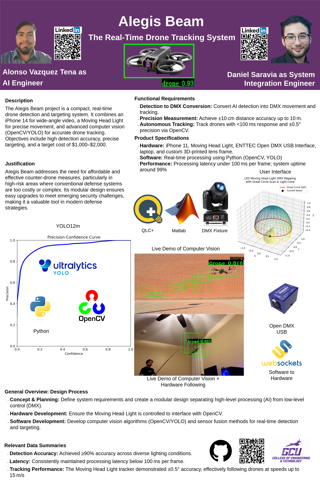
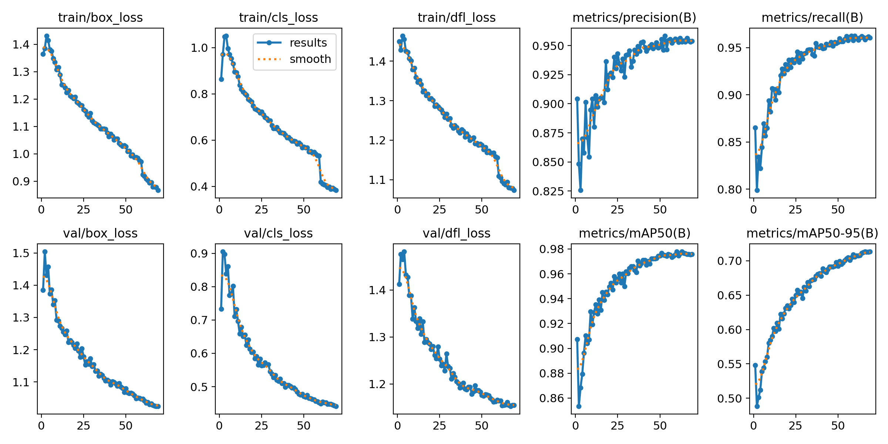
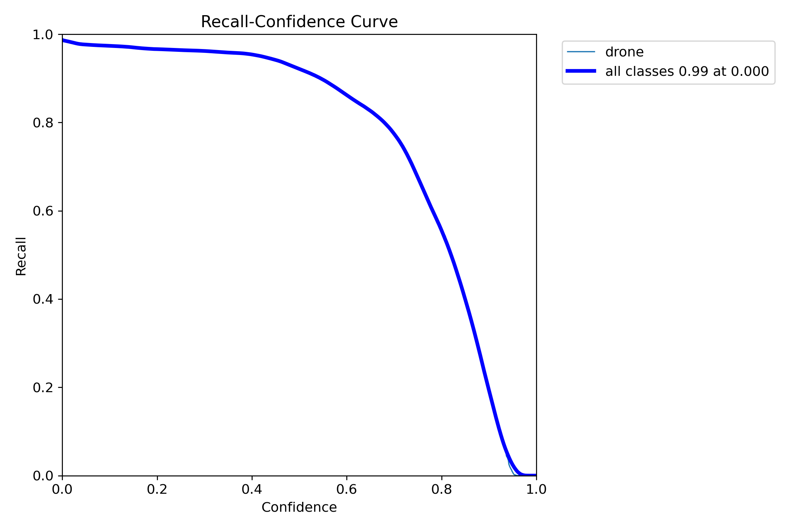
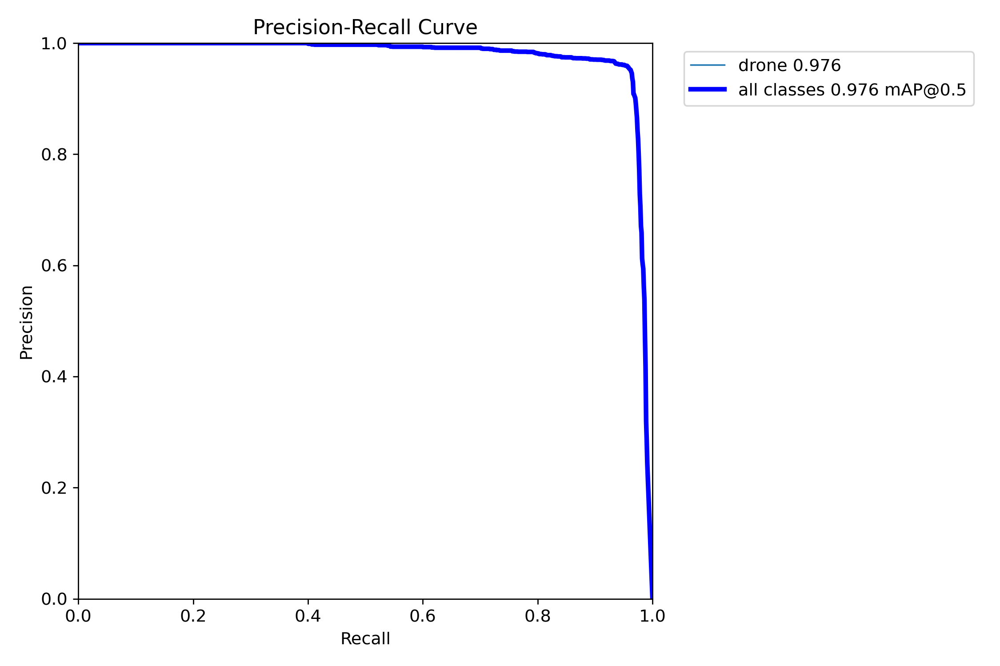
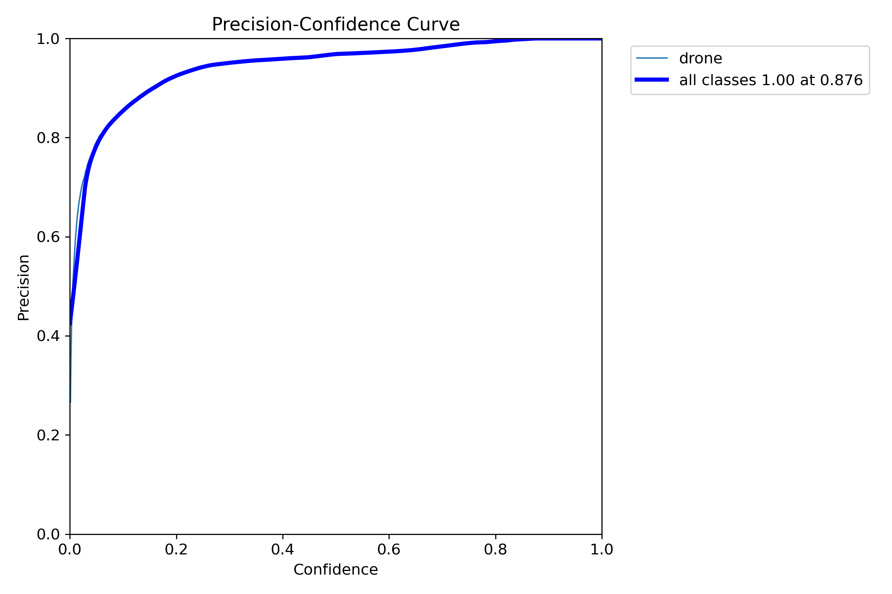
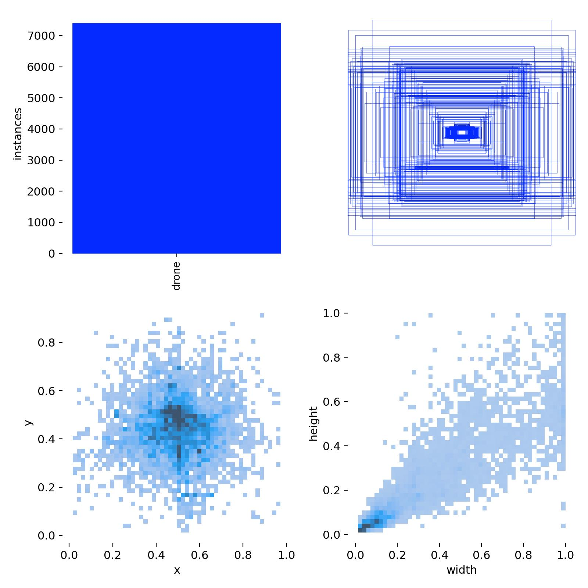
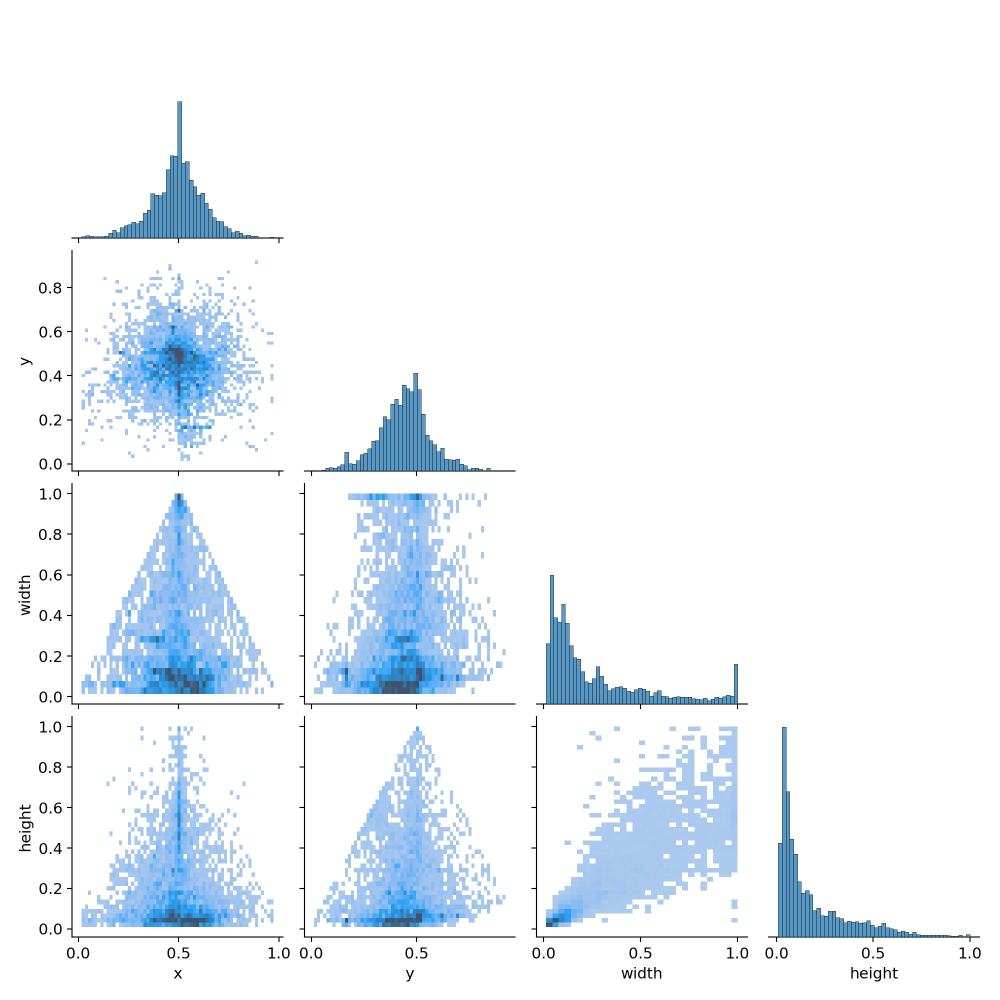
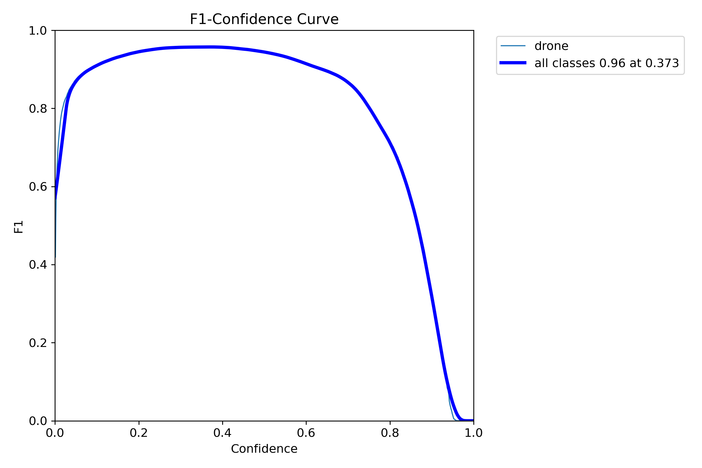
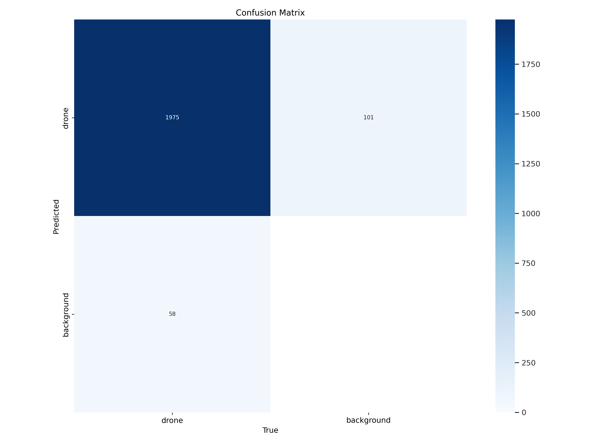
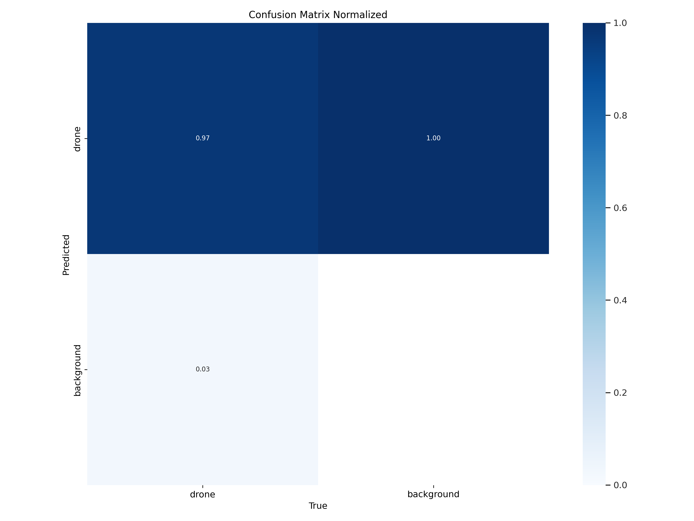

# AIegis Beam

## Table of Contents
- [Project Overview](#project-overview)
- [Key Features](#key-features)
- [System Architecture](#system-architecture)
- [Installation](#installation)
- [Usage](#usage)
- [Hardware Setup](#hardware-setup)
- [Model Training](#model-training)
- [Testing](#testing)
- [Troubleshooting](#troubleshooting)
- [Contributing](#contributing)
- [License](#license)
- [Maintainers](#maintainers)
- [Citations and Acknowledgements](#citations-and-acknowledgements)


## Project Overview


A real-time counter-drone system using computer vision and object tracking. Detects UAVs in video streams and simulates countermeasures (target locking).

## Key Features
- Real-time object detection using YOLO12
- Centroid-based object tracking
- Frame processing pipeline (1920x1080 @ 120FPS)
- Configurable detection thresholds and tracking parameters

## System Architecture
```
.
├── notebooks
│   └── ai_model_training.ipynb       # AI model training notebook
├── src
│   ├── ai_model_interface.py         # AI model wrapper
│   ├── detection_processor.py        # Filters/processes AI detections
│   ├── dmx_control.py
│   ├── DMX_frame_pipeline.py
│   ├── drone_detector_12l.pt         # YOLO12l drone detector model
│   ├── drone_detector_12m.pt         # YOLO12m drone detector model
│   ├── drone_detector_12n.pt         # YOLO12n drone detector model
│   ├── drone_detector_12s.pt         # YOLO12s drone detector model
│   ├── drone_detector_12x.pt         # YOLO12x drone detector model (SEE NOTE BELOW)
│   ├── frame_pipeline.py             # Main processing workflow
│   ├── frame_processor.py            # Frame resizing/normalization
│   ├── main.py                       # Program execution code
│   ├── qlight_workspace.qxw
│   ├── run.py
│   ├── run.sh
│   ├── tracking_system.py            # Object tracking implementation
│   └── video_stream_manager.py       # Camera/stream input handling
├── test
│   └── test_ai.py                    # Detection test for AI model
└── test_images
    ├── drone_mock_test_1.jpg         # Sample mock test image
    ├── drone_mock_test_2.jpg         # Sample mock test image
    ├── drone_mock_test_3.jpg         # Sample mock test image
    ├── drone_real_test_1.jpg         # Sample real test image
    ├── drone_real_test_2.jpg         # Sample real test image
    ├── drone_real_test_3.jpg         # Sample real test image
    ├── drone_real_test_4.jpg         # Sample real test image
    ├── drone_real_test_5.jpg         # Sample real test image
    ├── drone_real_test_6.jpg         # Sample real test image
    ├── drone_real_test_7.jpg         # Sample real test image
    ├── drone_real_test_8.jpg         # Sample real test image
    ├── drone_real_test_9.jpg         # Sample real test image
    ├── drone_real_test_10.jpg        # Sample real test image
    ├── drone_real_test_11.jpg        # Sample real test image
    ├── drone_real_test_12.jpg        # Sample real test image
    ├── drone_real_test_13.jpg        # Sample real test image
    ├── drone_real_test_14.jpg        # Sample real test image
    └── drone_real_test_15.jpg        # Sample real test image
```

NOTE: drone_detector_12x.pt could not be added to the repository due to its size (exceeds 100MB). The download link is here: https://drive.google.com/file/d/1yzFKtHaEQzx3OuTVzEUAEHYwTYP83IO0/view?usp=drive_link
## Installation

### Prerequisites
- Python 3.11.9
- PIP 25.0.1
- Windows 11 or Ubuntu 20.04
- Nvidia GPU (to use CUDA)
- USB Webcam or IP Camera

```bash
# Clone repository
git clone https://github.com/alonsovazqueztena/Mini_C-RAM_Capstone.git
cd Mini_C-RAM_Capstone

# Create virtual environment
python -m venv env
source env/bin/activate      # Linux/MacOS
source env/Scripts/activate  # Windows

# Install dependencies
pip install -r requirements.txt
```

## Usage

### Basic Operation
```bash
# Execute the program using the source code (must be in src folder)
python main.py
```

#### Keyboard Control
| Key | Description            |
|-----|------------------------|
| q   | Quit system            |

## Hardware Setup
**Camera Connection**
- **USB Webcam**: Plug into available USB port
- **IP Camera**: Set RTSP URL

## Model Training
### General Steps
1. The Junyper notebook used to train the YOLO12 models is found within the notebooks folder:

```
.
├── notebooks
│   └── ai_model_training.ipynb       # AI model training notebook
```

2. Use **Google Colab** to ensure proper functionality and avoidance of dependency issues.

3. Ensure that CUDA is installed to allow for proper leveraging of the GPU if available.

```bash
# Ensure that CUDA is available to be used for faster, 
# optimized AI training.

!nvidia-smi

import torch

print("torch.cuda.is_available():", torch.cuda.is_available())
print("torch.cuda.device_count():", torch.cuda.device_count())
```

4. Replace the following file paths:

```bash
# Check if Google Drive is able to
# be accessed.
!ls Insert Google Drive path here
```

```bash
# If Google Drive is present, remove it
# to ensure we can mount it again.
!rm -rf Insert Google Drive path here
```

```bash
# We import the Google Drive again.
from google.colab import drive

# We mount the Google Drive.
drive.mount('Insert Google Drive path here')
```

```bash
# Check if we can access the images dataset.
!ls "Insert images dataset path here"
```

```bash
# Load and execute a live feed of the Tensorboard graphs.
%load_ext tensorboard
%tensorboard --logdir insert/directory/to/runs/here
```

```bash
# We take in the Tensorboard log directory.
tensorboard_log_dir = "Insert Tensorboard log directory path here"
```

```bash
# We load in the YOLO model here.
    model = YOLO(
        "Insert your YOLO model directory path here")
```

```bash
# We train for one epoch here.

    # We bring in the data through a YAML file, establish
    # the image size, assign what device we will save (GPU CUDA),
    # enable automatic saving, save every epoch, set the TensorBoard
    # log directory, and log each run separately.
    train_results = model.train(
        data="Insert your image dataset YAML file path here",
        epochs=100, imgsz=640, device="cuda", save=True, save_period=1,
        project=tensorboard_log_dir, name=f"session(insert-number)"
        )
```

5. Execute each cell from top to bottom, one at a time.

6. To check live results of the AI model training, examine the Tensorboard server run in this cell:
```bash
# Load and execute a live feed of the Tensorboard graphs.
%load_ext tensorboard
%tensorboard --logdir insert/directory/to/runs/here
```

### Expected Results
- **Tensorboard logs directory**: Every run will be its own subdirectory. In it, the following will be contained:

  1. Weights folder (every epoch weight, last weight, best weight)

  2. Validation batches (predictions and labels)

  3. Train batches

  4. Metric results (Graphs and CSV): box loss (train and validation), cls loss (train and validation), dfl loss (train and validation), precision (B), recall (B), mAP50 (B), and mAP50-95 (B)

  5. Curve graphs: Precision, recall,  precision-recall, and F1

  6. Label graphs (regular and correlogram)

  7. Confusion matrix graphs (regular and normalized)

  8. Training arguments YAML file

### Drone Detection AI Model Results
The following results were achieved with the final YOLO12m model used for this project:

- **Metric Graphs:**



- **Recall-Confidence Curve:**



- **Precision-Recall Curve:**



- **Precision-Confidence Curve:**



- **Label Graphs:**



- **Label Correlogram:**



- **F1 Curve:**



- **Confusion Matrix:**



- **Confusion Matrix (Normalized):**



## Testing
### Module Testing

To test the following modules:
- **Video Stream Manager**
- **Frame Processor**
- **AI Model Interface**
- **Detection Processor**
- **Tracking System**
- **Frame Pipeline**

Run:

```bash
# Ensure you are in the correct directory.

cd src

# Run all main module tests of the program.

python main.py
```

### AI Model Testing

1. The AI testing script is found within the test folder:

```
.
├── test
│   └── test_ai.py                    # Detection test for AI model
```

2. Update this filepath to any of the YOLO model filepaths:
```bash
# We create an instance of the trained YOLO model here.
model = YOLO("insert_yolo_model_filepath_here")
```

3. Update this filepath to your test image filepath:
```bash
results = model.predict(
    "insert_test_image_filepath_here", conf=0.5, 
    imgsz=640, show=True, save=True, project="..\\runs")
```

4. To test the AI model, run:

```bash
# Ensure you are in the correct directory.

cd test

# Run a sign language detection test on an image (must be in JPG format).

python test_ai.py   # Results in runs folder
```

5. A runs folder will be created or used if present. Within it, a predict folder will be created for every prediction made on an image. The image will have the AI predictions labelled:
```
.
└── runs
    └── predict 
        └── processed_test_image.jpg  # Detection test for AI model
```
## Troubleshooting
### ERROR: No frames available.
Ensure that all the capture device indexes match to your capture device (0 if its an internal webcam, 1 if its an external webcam such as an Iriun webcam or GoPro).

video_stream_manager.py:
```bash
def __init__(
            self, capture_device=1, # Update the capture device index.
            frame_width=1920, frame_height=1080,
            max_queue_size=5):
```

run.py:
```bash
# Initialize the FramePipeline with required parameters.
        pipeline = FramePipeline(
            capture_device=0, # Update the capture device index.
            frame_width=1920,
            frame_height=1080,
            target_width=1920,
            target_height=1080,
            model_path="drone_detector_12x.pt",
            confidence_threshold=0.5
        )
```

main.py:
```bash
# This method tests the video stream manager 
# by attempting to capture a single frame.
def test_video_stream_manager():
    """Test the VideoStreamManager by attempting 
    to capture a single frame."""

    try:
        # This initializes the video stream manager.
        video_stream = VideoStreamManager(
            capture_device=1, frame_width=1920, # Update the capture device index.
            frame_height=1080)
```
```bash
def test_frame_pipeline():
    """Test the FramePipeline by 
    running a continuous video stream at full HD,
    processing each frame, and running AI detection."""

    try:
        # The frame pipeline is initialized.
        pipeline = FramePipeline(
            capture_device=1, # Update the capture device index.
            frame_width=1920, 
            frame_height=1080, 
            target_width=1920, 
            target_height=1080,
            model_path="drone_detector_12x.pt",
            confidence_threshold=0.5
        )
```

frame_pipeline.py:
```bash
class FramePipeline:
    """A pipeline that captures frames from a video stream, processes them, 
    runs YOLO + detection filtering, then tracks objects over time."""

    # This method initializes the frame pipeline.
    def __init__(
        self,
        capture_device=1, # Update the capture device index.
        frame_width=1920,
        frame_height=1080,
        target_width=1920,
        target_height=1080,
        model_path="drone_detector_12x.pt",
        confidence_threshold=0.5,
        detection_processor=None,
        tracking_system=None
    ):
```

DMX_frame_pipeline.py:
```bash
class FramePipeline:
    """A pipeline that captures frames from a video stream, processes them, 
    runs YOLO + detection filtering, then tracks objects over time.
    Additionally, it uses the latest detection's centroid to control a moving head light via DMX."""
    
    def __init__(
        self,
        capture_device=1, # Update the capture device index.
        frame_width=1920,
        frame_height=1080,
        target_width=1920,
        target_height=1080,
        model_path="drone_detector_12x.pt",
        confidence_threshold=0.5,
        detection_processor=None,
        tracking_system=None
    ):
```

### Resolution Mismatch
Ensure that the frame resolution (width and height) is updated to match the video feed's resolution:

video_stream_manager.py:
```bash
class VideoStreamManager:
    """Creates and sets up the video stream manager."""

    # This method initializes the video stream manager.
    
    # The captured device is taken in as an index and the
    # frame is expected to be in full HD resolution.

    # Adjust the capture device index accordingly to
    # to your device as well as the resolution of
    # your camera.
    def __init__(
            self, capture_device=1, 
            frame_width=1920, frame_height=1080, # Update this resolution.
            max_queue_size=5):
```
run.py:
```bash
def main():
    # Configure logging to output messages with timestamp and level.
    logging.basicConfig(
        level=logging.INFO, 
        format="%(asctime)s - %(levelname)s - %(message)s"
    )
    
    try:
        # Initialize the FramePipeline with required parameters.
        pipeline = FramePipeline(
            capture_device=0,
            frame_width=1920,
            frame_height=1080, # Update this resolution.
            target_width=1920,
            target_height=1080, # Update this resolution.
            model_path="drone_detector_12x.pt",
            confidence_threshold=0.5
        )
```
qlight_workspace.qxw:
```bash
<Properties>
   <Size Width="1920" Height="1080"/> # Update this resolution.
   <GrandMaster ChannelMode="Intensity" ValueMode="Reduce" SliderMode="Normal"/>
  </Properties>
 </VirtualConsole>
 <SimpleDesk>
  <Engine/>
 </SimpleDesk>
</Workspace>
```

main.py:
```bash
# This method tests the video stream manager 
# by attempting to capture a single frame.
def test_video_stream_manager():
    """Test the VideoStreamManager by attempting 
    to capture a single frame."""

    try:
        # This initializes the video stream manager.
        video_stream = VideoStreamManager(
            capture_device=1, frame_width=1920, 
            frame_height=1080) # Update this resolution.
```
```bash
# This method tests the frame processor by processing a dummy image.
def test_frame_processor():
    """Test the FrameProcessor by processing a dummy image."""

    try:
        # This initializes the frame processor.
        processor = FrameProcessor(
            target_width=1920, target_height=1080) # Update this resolution.
```
```bash
# This method tests the frame pipeline by 
# running a continuous video stream at 640x480,
# processing each frame, and running YOLO detection.
def test_frame_pipeline():
    """Test the FramePipeline by 
    running a continuous video stream at full HD,
    processing each frame, and running AI detection."""

    try:
        # The frame pipeline is initialized.
        pipeline = FramePipeline(
            capture_device=1, 
            frame_width=1920, 
            frame_height=1080, # Update this resolution.
            target_width=1920, 
            target_height=1080, # Update this resolution.
            model_path="drone_detector_12x.pt",
            confidence_threshold=0.5
        )
```
frame_processor.py:
```bash
class FrameProcessor:
    """Creates and sets up the frame processor."""

    # This method initializes the frame processor.
    
    # The target width and height of the frame are taken in as arguments.

    # This can be adjusted as necessary, in this case, we keep
    # it as the full HD resolution.
    def __init__(
            self, target_width=1920, 
            target_height=1080): # Update this resolution.
```
frame_pipeline.py:
```bash
class FramePipeline:
    """A pipeline that captures frames from a video stream, processes them, 
    runs YOLO + detection filtering, then tracks objects over time."""

    # This method initializes the frame pipeline.
    def __init__(
        self,
        capture_device=1,
        frame_width=1920,
        frame_height=1080, # Update this resolution.
        target_width=1920,
        target_height=1080, # Update this resolution.
        model_path="drone_detector_12x.pt",
        confidence_threshold=0.5,
        detection_processor=None,
        tracking_system=None
    ):
```
DMX_frame_pipeline.py:
```bash
class FramePipeline:
    """A pipeline that captures frames from a video stream, processes them, 
    runs YOLO + detection filtering, then tracks objects over time.
    Additionally, it uses the latest detection's centroid to control a moving head light via DMX."""
    
    def __init__(
        self,
        capture_device=1,
        frame_width=1920,
        frame_height=1080, # Update this resolution.
        target_width=1920,
        target_height=1080, # Update this resolution.
        model_path="drone_detector_12x.pt",
        confidence_threshold=0.5,
        detection_processor=None,
        tracking_system=None
    ):
```
### Testing Different AI Models
Ensure that the filepaths for the AI model are updated to the desired AI model's filepath:

run.py:
```bash
def main():
    # Configure logging to output messages with timestamp and level.
    logging.basicConfig(
        level=logging.INFO, 
        format="%(asctime)s - %(levelname)s - %(message)s"
    )
    
    try:
        # Initialize the FramePipeline with required parameters.
        pipeline = FramePipeline(
            capture_device=0,
            frame_width=1920,
            frame_height=1080,
            target_width=1920,
            target_height=1080,
            model_path="drone_detector_12m.pt", # Update this filepath.
            confidence_threshold=0.5
        )
```
main.py:
```bash
# This method tests the AI model interface by 
# running inference on a sample image.
def test_ai_model_interface():
    """Test the AIModelInterface by 
    running inference on a sample image."""

    try:
        # This initializes the AI model interface.
        ai_interface = AIModelInterface(
            model_path="drone_detector_12x.pt", # Update this filepath.
            confidence_threshold=0.5)
```
```bash
# This method tests the detection processor by 
# running AI on a sample image
# and then processing the raw detections.
def test_detection_processor():
    """ Test the DetectionProcessor by running AI on a sample image
    and then processing the raw detections."""

    try:
        # The YOLO model interface is initialized.
        ai_interface = AIModelInterface(
            model_path="drone_detector_12x.pt", # Update this filepath.
            confidence_threshold=0.5)
```
```bash
# This method tests the frame pipeline by 
# running a continuous video stream at 640x480,
# processing each frame, and running YOLO detection.
def test_frame_pipeline():
    """Test the FramePipeline by 
    running a continuous video stream at full HD,
    processing each frame, and running AI detection."""

    try:
        # The frame pipeline is initialized.
        pipeline = FramePipeline(
            capture_device=1, 
            frame_width=1920, 
            frame_height=1080, 
            target_width=1920, 
            target_height=1080,
            model_path="drone_detector_12x.pt", # Update this filepath.
            confidence_threshold=0.5
        )
```
frame_pipeline.py:
```bash
# This class serves as a frame pipeline that 
# captures frames from a video stream,
# processes them, runs AI + detection filtering, 
# then tracks objects over time.
class FramePipeline:
    """A pipeline that captures frames from a video stream, processes them, 
    runs YOLO + detection filtering, then tracks objects over time."""

    # This method initializes the frame pipeline.
    def __init__(
        self,
        capture_device=1,
        frame_width=1920,
        frame_height=1080,
        target_width=1920,
        target_height=1080,
        model_path="drone_detector_12x.pt", # Update this filepath.
        confidence_threshold=0.5,
        detection_processor=None,
        tracking_system=None
    ):
```
DMX_frame_pipeline.py:
```bash
class FramePipeline:
    """A pipeline that captures frames from a video stream, processes them, 
    runs YOLO + detection filtering, then tracks objects over time.
    Additionally, it uses the latest detection's centroid to control a moving head light via DMX."""
    
    def __init__(
        self,
        capture_device=1,
        frame_width=1920,
        frame_height=1080,
        target_width=1920,
        target_height=1080,
        model_path="drone_detector_12x.pt", # Update this filepath.
        confidence_threshold=0.5,
        detection_processor=None,
        tracking_system=None
    ):
```
ai_model_interface.py:
```bash
class AIModelInterface:
    """Interface for the AI model to run inference 
    and process detections."""

    # This method initializes the AI model interface.

    # The model path is where our trained AI model is stored and
    # the confidence threshold is the minimum 
    # confidence score for detections.

    # For this AI model, we expect the confidence score threshold 
    # to be 0.5 to allow optimal performance.
    def __init__(
            self, model_path="drone_detector_12x.pt", # Update this filepath.
            confidence_threshold=0.5):
        """
```
test_ai.py:
```bash
# We create an instance of the trained YOLO model here.
model = YOLO("..\src\drone_detector_12x.pt") # Update this filepath.
```
## Contributing

1. Fork the repository
2. Create a feature branch:
```bash
git checkout -b feature/new-tracker
```
3. Add tests for new functionality
4. Submit a pull request

### Coding Standards
- PEP8 compliance
- Docstrings for all modules
- 80%+ test coverage

## License
MIT License - See LICENSE for details

## Maintainers
- Alonso Vazquez Tena: AI Engineer
- Daniel Saravia: System Integration Engineer

**Mentor**: Ryan Woodward  

## Citations and Acknowledgements
**YOLO12**  
```bibtex
@article{tian2025yolov12,
  title={YOLOv12: Attention-Centric Real-Time Object Detectors},
  author={Tian, Yunjie and Ye, Qixiang and Doermann, David},
  journal={arXiv preprint arXiv:2502.12524},
  year={2025}
}

@software{yolo12,
  author = {Tian, Yunjie and Ye, Qixiang and Doermann, David},
  title = {YOLOv12: Attention-Centric Real-Time Object Detectors},
  year = {2025},
  url = {https://github.com/sunsmarterjie/yolov12},
  license = {AGPL-3.0}
}
```

**Image Dataset**
```bibtex
@misc{uavs-vqpqt_dataset,
  title = { UAVs Dataset },
  type = { Open Source Dataset },
  author = { UAVS },
  howpublished = { \url{ https://universe.roboflow.com/uavs-7l7kv/uavs-vqpqt } },
  url = { https://universe.roboflow.com/uavs-7l7kv/uavs-vqpqt },
  journal = { Roboflow Universe },
  publisher = { Roboflow },
  year = { 2024 },
  month = { dec },
  note = { visited on 2025-03-26 },
}
```
